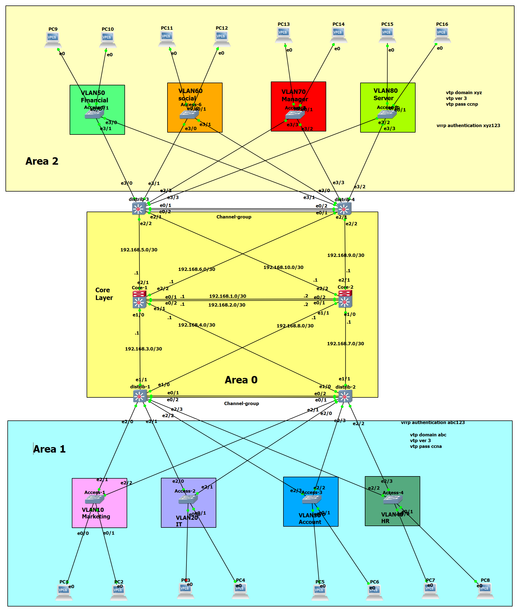

# Campus Network Infrastructure Project 🌐

This repository contains the configuration files for a high-availability enterprise network based on the **Three-Tier Hierarchical Design**. The project focuses on intelligent **Load Sharing** and deterministic path selection at the Distribution Layer.

---

## 🏗️ Network Topology

The architecture follows the Cisco Hierarchical Model to ensure scalability, resilience, and ease of management.

---

## 🛠️ Tech Stack & Protocols

### **High Availability & Load Sharing**
* **VRRP Active-Active:** Roles are distributed so that each switch acts as a **Primary Gateway** for specific VLANs and a **Backup Gateway** for others, ensuring 100% hardware utilization.
* **Per-VLAN Spanning Tree (PVST+):** Customized **Root Bridge** priorities for each VLAN to align Layer 2 forwarding paths with Layer 3 routing exits.
* **Rapid-PVST+:** Ensures loop-free topology with ultra-fast convergence times.
* **VTP v3:** Provides secure and centralized VLAN database management across isolated domains.

### **Routing & Services**
* **Multi-Area OSPF:** Connects the Distribution layer to the Core via Area 0, Area 1, and Area 2 to optimize routing tables and isolate traffic.
* **LACP EtherChannel:** Link aggregation used to increase bandwidth between switches and provide physical redundancy.
* **DHCP Pools:** Localized address allocation at the Distribution layer to reduce latency and broadcast traffic.

---

## 📁 Distribution Layer Operations Matrix

| Device | Sector | Functional Role | Primary VLANs (Root/Master) | STP Priority |
| :--- | :--- | :--- | :--- | :--- |
| **Distrib-1** | South | Multi-Service Gateway | Marketing & IT (10, 20) | 24576 |
| **Distrib-2** | South | Multi-Service Gateway | Account & HR (30, 40) | 24576 |
| **Distrib-3** | North | Multi-Service Gateway | Engineering & Research (50, 60) | 24576 |
| **Distrib-4** | North | Multi-Service Gateway | Logistics & Management (70, 80) | 24576 |

---

## 🚀 Key Engineering Notes

1. **Deterministic Pathing:** STP and VRRP priorities are manually synchronized to ensure predictable traffic flow and prevent sub-optimal "triangular" routing.
2. **Logical Isolation:** North and South sectors are logically separated using different VTP Domains (`abc` & `xyz`) to enhance security and limit failure domains.
3. **No Idle Hardware:** By utilizing an Active-Active design, the network avoids "Standby" waste, processing data across all available links and processors simultaneously.

---

## 👨‍💻 Engineer's Oversight
**This infrastructure is designed and documented to achieve 99.99% uptime and maximum throughput efficiency.**ندس
**تم تصميم وتوثيق هذه الشبكة لتعمل بأقصى كفاءة ممكنة مع ضمان توافر الخدمة بنسبة 99.99%.**
